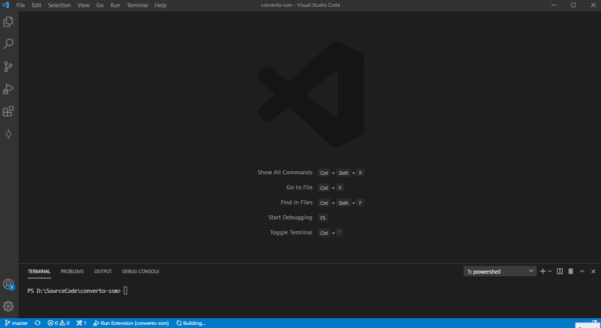
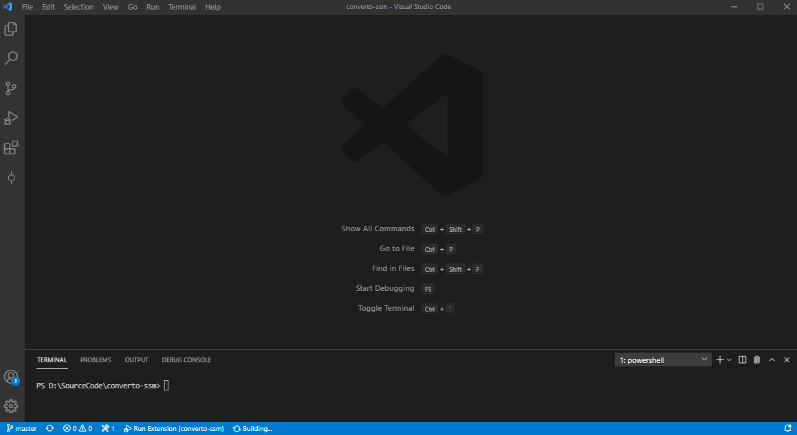
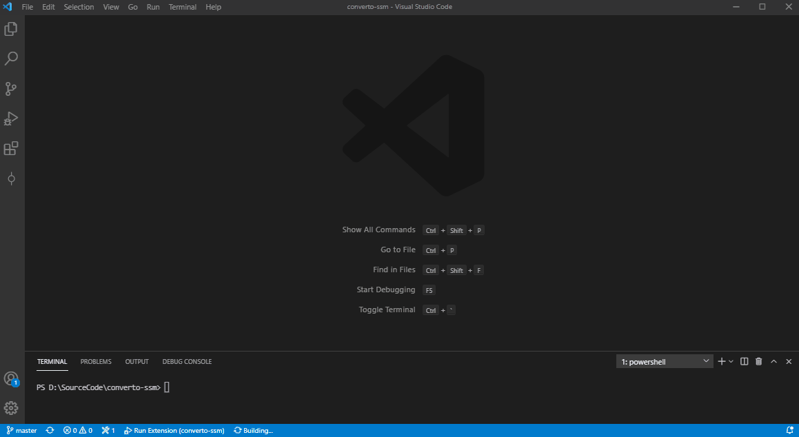
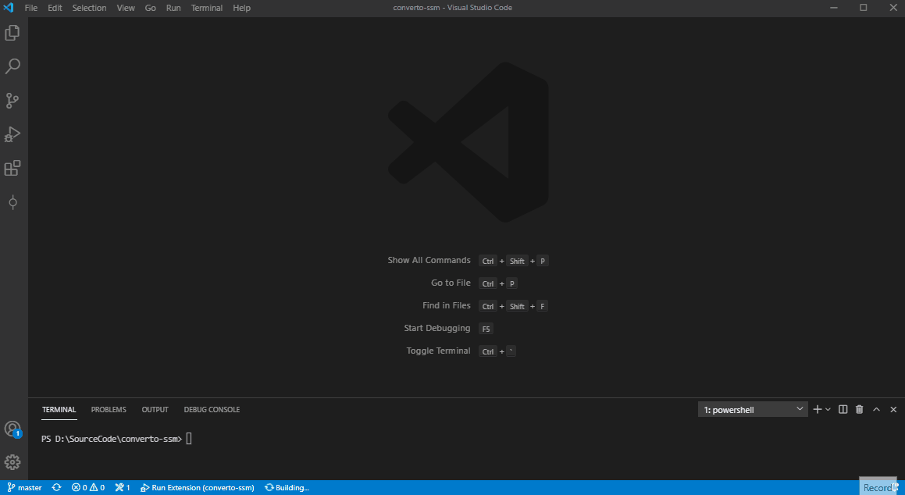

# Convert To AWS SSM

Convert Powershell and/or Shell scripts to AWS SSM documents.

## Features

This plugin is capable of generating both JSON and YAML AWS SSM Documents from PowerShell and/or Shell scripts.
It is also capable of retrieving the script back from an SSM document.
It does not support SSM documents with multiple steps.

## Usage

1. Open a PowerShell or Shell script of your choice
2. Open the Command Palette (F1 or CMD/CTRL+Shift+P or "View" > "Command Palette...")
3. Search for "ConvertTo-SSM", and two options will appear
    - "ConvertTo-SSM: Create JSON document"
    - "ConvertTo-SSM: Create YAML document"
    - "ConvertTo-SSM: Get script from AWS SSM document"
4. Click desired conversion option

## Configurations

- *EnableAutoCopyToClipboard*
    - When enabled, the SSM document output is automatically copied to the clipboard

- *EnableCopyRunCommandOnly*
    - When enabled alongside EnableAutoCopyToClipboard, it copies the 'RunCommand' section of the SSM command only (supported only on conversions from a script to SSM document)

## Instructions

### PowerShell To JSON SSM Documnet

### Shell script To JSON SSM Documnet

### PowerShell to YAML SSM document

### Shell script to YAML SSM document

## Known Issues

N/A

## Release Notes

[CHANGELOG](./CHANGELOG.md)

